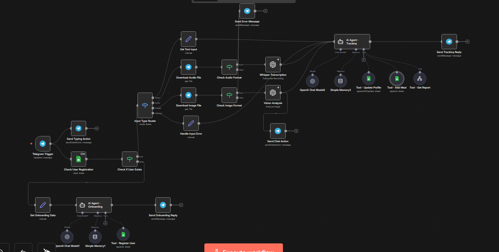
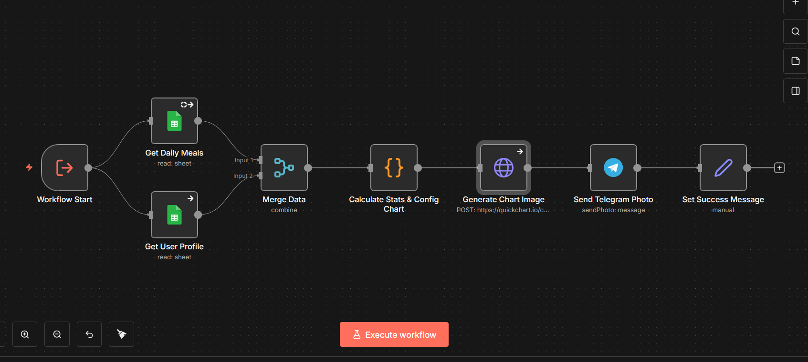

#  AI Nutritionist Telegram Bot (n8n Workflow)

Este repositorio contiene una arquitectura completa de automatización en **n8n** para un Asistente Nutricionista inteligente integrado con **Telegram**.

El sistema no es un simple chatbot; es una orquestación compleja que maneja entradas multimodales, gestión de estado, llamadas a APIs externas y generación dinámica de reportes visuales.

## Arquitectura del Sistema

### 1. Workflow Principal (Orquestador)
El flujo principal actúa como el cerebro del sistema, gestionando la interacción con el usuario y el enrutamiento inteligente.

**Características destacadas:**
* ** Enrutamiento Multimodal:** Capacidad para procesar diferentes tipos de entrada gracias al nodo *Input Type Router*:
    * **Texto:** Procesamiento directo.
    * **Audio:** Transcripción automática usando **OpenAI Whisper**.
    * **Imagen:** Análisis de visión (Vision Analysis) para reconocimiento de comidas mediante IA.
* ** Agentes IA Especializados:**
    * **Onboarding Agent:** Se encarga del registro de nuevos usuarios y recopilación de datos iniciales.
    * **Tracking Agent:** Gestiona el seguimiento diario, conteo de calorías y consultas generales.
* ** AI Tools & Memoria:** Implementación de *Window Buffer Memory* y herramientas personalizadas para conectar la IA con la base de datos (Google Sheets) para leer/escribir perfiles y comidas.

### 2. Sub-workflow (Generador de Reportes)
Para mantener la modularidad y limpieza, la lógica de generación de reportes se extrajo a un sub-workflow dedicado.

**Funcionalidades técnicas:**
* ** Generación de Gráficos (HTTP Request):** Integra la API de **QuickChart.io** mediante peticiones HTTP POST para generar visualizaciones de progreso en tiempo real.
* ** Procesamiento de Datos:** Nodos de *Code* para calcular estadísticas y fusionar datos (*Merge Data*) provenientes de múltiples hojas de cálculo.
* **telegram Output:** Envío del reporte visual renderizado directamente al chat del usuario.

##  Tecnologías y Nodos Clave
* **n8n** (Self-hosted)
* **OpenAI API** (Modelos GPT-4o/GPT-4-turbo, Whisper, Vision)
* **Google Sheets** (Como base de datos backend)
* **Telegram Bot API**
* **QuickChart API** (Vía HTTP Request Node)
* **Conceptos aplicados:** Modularidad (Sub-workflows), Tool Calling, Branching Logic, JSON Processing.

##  Estructura del Repositorio
* `/workflows`: Contiene los archivos JSON importables a n8n.
* `/assets`: Capturas de pantalla del funcionamiento y estructura.

---
*Proyecto desarrollado para demostrar capacidades avanzadas de automatización con IA.*
